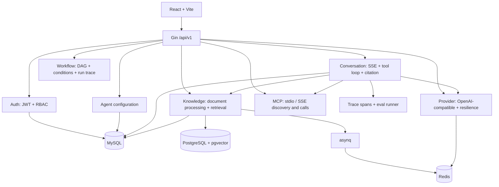

# Hify 作品集与面试提纲

## 项目定位与真实性边界

Hify 是一个 Go + React 的简化版 LLM 应用开发平台学习项目，覆盖 Provider、RAG、MCP、流式对话、Workflow、Trace 和 Eval 等能力。项目主要由 AI 工具辅助实现；我不会将其表述为独立完成的生产平台。

我能基于当前代码和提交记录说明关键数据流、设计取舍、验证方式与已知限制，并对 AI 辅助实现进行方案判断和验收。对尚未读懂或无法接受追问的细节，应如实说明并回到代码学习。

## 架构图



## 运行与验证

```bash
cp .env.example .env
make db-up
go run ./cmd/hify migrate up

# 开发：前端跑 Vite dev server，与后端分开
make dev
make web-dev

# 打包：前端经 go:embed 内嵌，产出**单个二进制**，只需 8080 一个端口
make build && ./bin/hify serve

make test
make test-race
make eval-retrieval-gate                                  # 确定性回归门禁，无 LLM
make eval JUDGE_MODEL_ID=<UUID> EVAL_USER_ID=<UUID>       # 带 LLM 裁判
```

`make test` 会执行 vet 和 Go 测试；依赖容器的集成测试在容器未启动时会跳过。

**两个 eval 目标职责不同，别混用**：`make eval-retrieval-gate` 是确定性回归门禁
（受控数据集、真实 pg_trgm、无 LLM 无裁判），**用来证明「行为没变」**；
`make eval` 带 LLM 裁判，同一份代码跑两次分数都不一样，**不能**用来证明行为没变。
`make eval` 依赖的 id 只存在于本地数据库，环境从零重建见 `docs/eval-environment-setup.md`。

## 可核对的提交证据

| 能力 | 提交 |
| --- | --- |
| RAG citation V1 全链路 | `1c8b852` |
| 文档处理幂等、可恢复性与租约并发安全 | `1351910` |
| Trace/span 与 eval harness | `d3addfb` |
| 确定性 RAG 评测指标与真实评测集 | `ed2e3bb`、`ee19672` |
| MCP 工具接入与简化 Workflow | `1c224f1`、`380a7fa` |

## 10 分钟介绍

1. **0:00–1:00｜定位与边界**：说明这是 AI 辅助的学习项目；我重点学习和验收 Go 后端中的 Agent 系统设计，不把全部实现说成个人独立完成。
2. **1:00–2:30｜模块边界**：从 Gin API 到 Provider、Knowledge、Agent、Conversation、MCP、Workflow；模块通过 Service 接口协作。
3. **2:30–5:00｜RAG 主链路**：文档处理异步入队、embedding、pgvector 检索、上下文装配与 citation 返回。
   有时间可以带一句十二轮迭代里最能讲的一条：**检索范围过滤的「下推」**——按文档/页码过滤
   下推进召回 SQL，而不是召回完在应用层筛。两者的区别可观测：应用层筛会让被筛掉的名额白白
   浪费，下推则把名额让给范围内排名更后的片段。详见 `docs/rag-study-guide.md` §3 Phase 10。
4. **5:00–6:30｜对话与工具**：SSE 流式输出、工具调用循环、MCP 工具发现和调用，以及最大迭代保护。
5. **6:30–8:00｜可靠性取舍**：Provider 的限流、熔断与重试边界；流客户端断开时的资源治理；文档处理的幂等与租约。
6. **8:00–9:00｜可观测与评测**：Trace/span、固定评测集、确定性检索/引用指标与 LLM Judge 的职责差异。
7. **9:00–10:00｜限制与现场定位**：说明本地存储、多实例和 faithfulness eval 等限制；可现场打开 `cmd/hify/main.go`、`internal/conversation/service.go`、`internal/knowledge/service.go`、`internal/eval/` 进一步解释。

## 你真正需要掌握的追问（10 题）

这些问题面向 AI 辅助项目的负责人/验收者，而非全栈代码作者。目标是能解释业务价值、模块关系、方案判断与验证边界；不要求背诵具体实现。

### 项目理解

1. Hify 想解决什么问题？它和 Dify 类平台相比，当前覆盖与刻意简化了哪些能力？
2. Provider、知识库、Agent、会话、MCP 和 Workflow 在产品里各自负责什么？它们如何协作？
3. 用户上传文档后，到最后在回答中看到引用，大致经历了什么流程？

### 方案与验收

4. 你怎样向 AI 描述“RAG citation 做完”的验收标准，避免只得到一个看起来有链接的答案？
5. 为什么要区分检索命中、引用正确和回答事实被原文支持？当前 Eval 已验证到哪一层？
6. 如果 AI 要改流式对话或工具调用，你会优先识别哪些用户体验、资源或数据一致性风险？
7. 你会要求哪些测试、真实接口证据或数据状态，才接受 AI 辅助完成的一次 RAG/流式改造？

### 风险与真实性边界

8. 这个项目为什么不应被描述为生产级平台？本地存储、多实例和外部模型依赖带来哪些限制？
9. Trace、监控与 Eval 分别帮助你回答什么问题？脱敏会带来什么收益和可观测性代价？
10. 项目中哪些工作由 AI 辅助完成？你实际负责了哪些方案判断、验收或学习工作？哪些细节还不能声称掌握？

## 数字的诚实边界（对外材料必读）

2026-09-02 起 embedding 是真实的（本地 Ollama + bge-m3，1024 维），此前是 32 维 mock。
换真实模型后跑出的**检索命中率 0.917 / 裁判平均 4.57 分**是「当前表现」，
**不是「提升幅度」**——改动前向量路根本跑不起来，没有对照组；测试集仅 14 条、语料两份 txt。

**任何场合都不要说「把召回率/准确率提升了 N」**，正确说法是
「在我那个 14 条用例的测试集上，当前检索命中率是 0.917，但我没有可比的改动前基线」。

另有一条实测值得讲：同一份代码跑两次，**确定性检索指标完全一致，裁判分有一条用例差 4 分**。
所以确定性指标可做回归、裁判分不可以——这个判断是实测出来的，不是从文档里读来的。

## 当前不要求掌握

- 不要求逐行解释 Go/React 实现、sqlc 生成代码或每个并发控制细节。
- 不要求声称独立实现完整 RAG、MCP、Workflow 或前端。
- 只有当面试岗位明确要求深挖某个模块，或你准备亲自维护它时，再按岗位需求阅读相应代码并补充实验。
